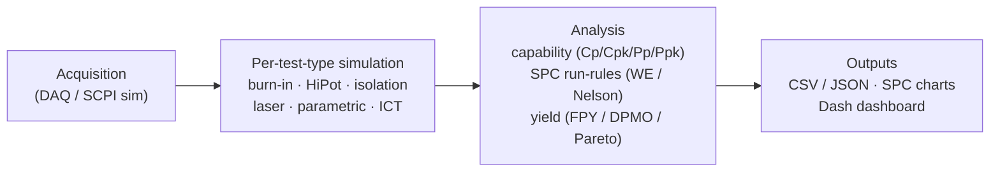
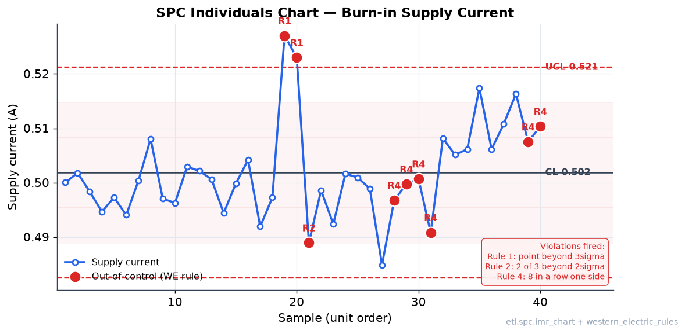
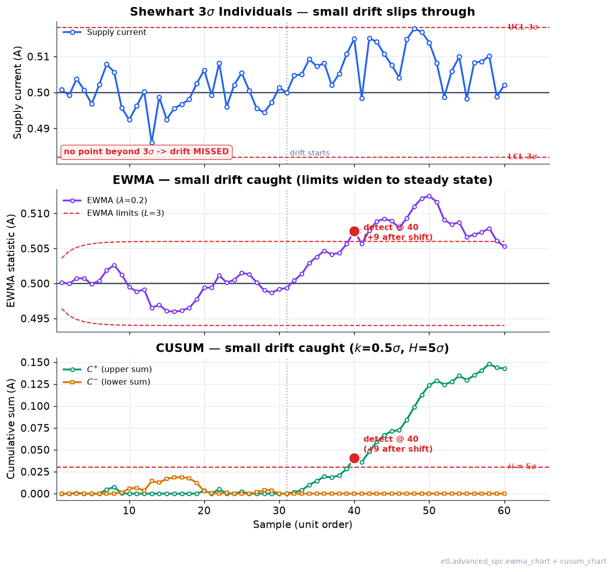
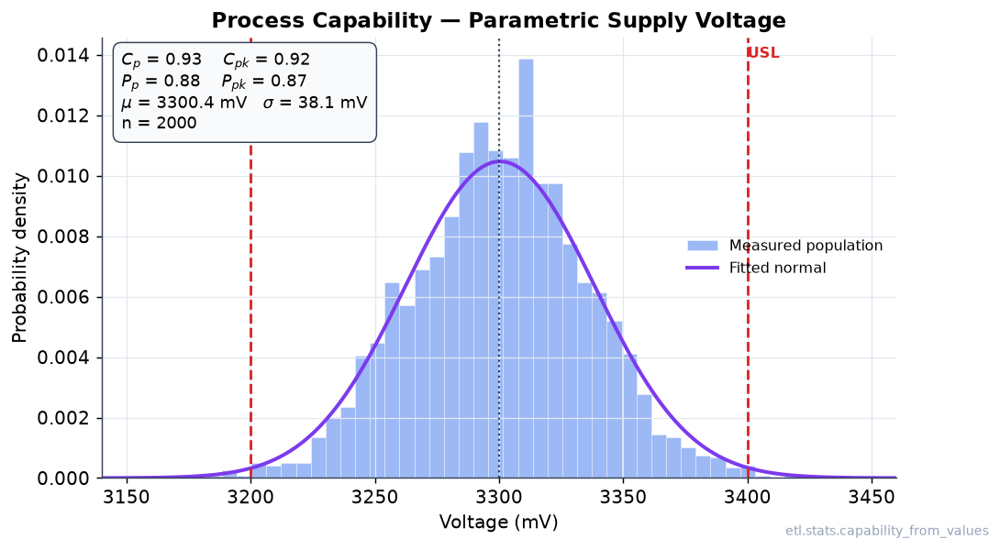
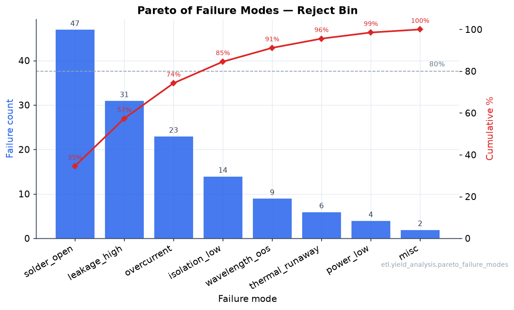
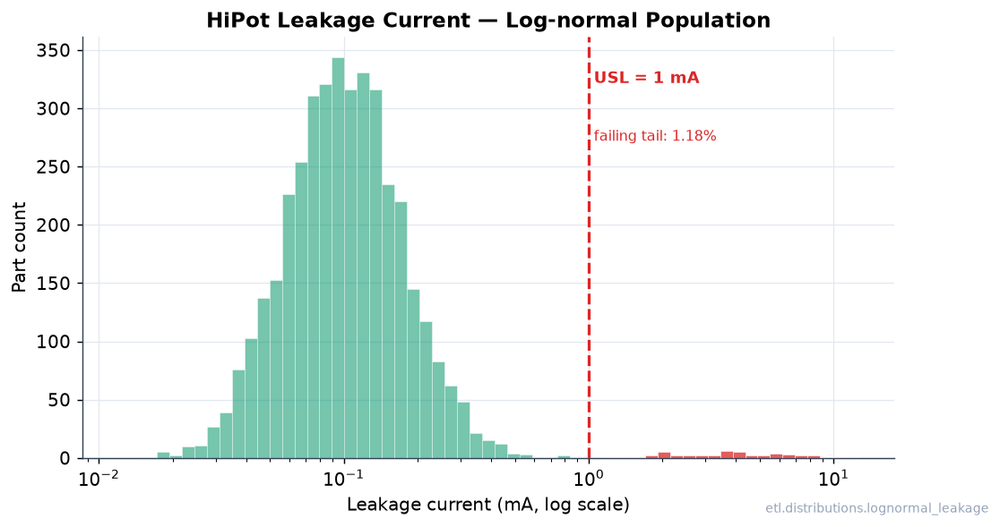

# Instrument Data Pipeline

This repository contains a suite of simulation tools for generating and analyzing test data for various electronic component tests, including burn-in, HiPot, isolation resistance, laser profile, parametric, and in-circuit tests.

## Overview

The project simulates data acquisition and analysis for different test types, generating realistic test data, plotting results, and saving statistics and raw data for further analysis. It includes both command-line tools and a web-based dashboard for viewing results.

The analytics layer is built for production / ATE work, not decoration: control limits use the proper Shewhart constants (Montgomery, Appendix VI) rather than naive mean ± 3·std, capability indices distinguish short-term (Cp/Cpk, within-subgroup σ via Rbar/d2) from long-term (Pp/Ppk, overall σ), and run-rule detection returns located Western-Electric / Nelson violations — not just a plotted line.

## Pipeline



## Visualizations

All figures below are generated from the **real** stats / SPC / yield / distribution API
(`scripts/make_figures.py`), not hand-drawn — re-run with
`python scripts/make_figures.py` to regenerate them into `assets/`.

### SPC control chart with run-rule detection

Individuals (I-MR) chart of a burn-in supply-current stream. Center line and 3σ control
limits come from `etl.spc.imr_chart` (limits derived from MRbar/d2, not mean ± 3·std);
out-of-control points are flagged in red by `etl.spc.western_electric_rules`, annotated
with the Western-Electric rule that fired (R1 = beyond 3σ, R2 = 2-of-3 beyond 2σ,
R4 = 8-in-a-row on one side).



### Small-shift detection (EWMA & CUSUM)

A Shewhart 3σ chart only reacts to a single point landing beyond its limits, so it is
deliberately deaf to a small *sustained* drift — a 0.5–1σ offset (slow burn-in
degradation, a creeping bias, a warming fixture) keeps every individual reading inside
±3σ yet shifts the whole stream. `etl.advanced_spc` adds the two charts purpose-built for
that regime, both of which accumulate evidence across consecutive points instead of
judging each one in isolation:

- **EWMA** (`ewma_chart`) — exponentially weighted moving average
  `zᵢ = λ·xᵢ + (1−λ)·zᵢ₋₁` (here λ=0.2), with *time-varying* control limits
  `target ± L·σ·√( (λ/(2−λ))·(1−(1−λ)^{2i}) )` that flare out from the target and settle
  at the steady-state half-width `L·σ·√(λ/(2−λ))`.
- **CUSUM** (`cusum_chart`) — tabular two-sided cumulative sum
  `C⁺ᵢ = max(0, C⁺ᵢ₋₁ + (xᵢ − (target + kσ)))` and
  `C⁻ᵢ = max(0, C⁻ᵢ₋₁ + ((target − kσ) − xᵢ))`, flagged when either crosses the decision
  interval `H = h·σ` (here k=0.5σ, h=5σ — the canonical 1σ-shift design).

In the figure below all three charts watch the **same** burn-in supply-current stream with
a 1σ drift injected at sample 30. The Shewhart 3σ chart (top) never alarms — no point
reaches 3σ. EWMA (middle) and CUSUM (bottom) both flag the drift ~9 samples later. The
EWMA limits visibly widen to their steady-state value; the CUSUM `C⁺` ramps past `H` while
`C⁻` stays near zero. A Monte-Carlo `average_run_length` helper and an ANOVA Gage R&R
(`gage_rr`, %GRR / ndc) measurement-systems-analysis routine round out the module.



### Process capability

Parametric supply-voltage population with LSL/USL, a fitted normal overlay, and the
Cp / Cpk / Pp / Ppk indices reported straight from `etl.stats.capability_from_values`
(short-term via within-subgroup σ, long-term via overall σ).



### Pareto of failure modes

Reject-bin failure modes ranked descending with the cumulative-percent line on a twin
axis (the classic "vital few" 80% cut), built from `etl.yield_analysis.pareto_failure_modes`.



### Leakage-current distribution

HiPot leakage-current population from `etl.distributions.lognormal_leakage` — a strictly
positive log-normal spanning decades (log x-axis) with a rare dielectric-breakdown tail.
The one-sided spec limit is marked and the failing tail shaded red.



### Live dashboard

For interactive exploration, `simple_dashboard.py` serves a [Dash](https://dash.plotly.com/)
app (auto-selects a free port from 8050) with a test-type selector, summary pass/fail
stats, interactive time-series plots, raw-data tables, and the generated PNG plots.

## Installation

1. Clone the repository:
   ```bash
   git clone <repository-url>
   cd instrument-data-pipeline
   ```

2. Create and activate a virtual environment:
   ```bash
   python -m venv venv
   source venv/bin/activate  # On Windows, use `venv\Scripts\activate`
   ```

3. Install the package in development mode:
   ```bash
   pip install -e .
   ```

4. Install additional dependencies for the web dashboard:
   ```bash
   pip install dash plotly
   ```

## Usage

### Running Simulations

Each simulation script can be run as a module. For example, to run the burn-in simulation:

```bash
python -m etl.simulations.burnin_simulation
```

Other available simulations:
- HiPot: `python -m etl.simulations.hipot_simulation`
- Isolation: `python -m etl.simulations.isolation_simulation`
- Laser: `python -m etl.simulations.laser_simulation`
- Parametric: `python -m etl.simulations.parametric_simulation`
- ICT: `python -m etl.simulations.ict_simulation`

### Running All Tests at Once

Use the master script to run all simulations:

```bash
python run_all_tests.py
```

This will:
- Run all 6 test simulations
- Generate plots, data files, and statistics
- Provide a summary of results

### Web Dashboard

After running tests, you can view results in an interactive web dashboard:

```bash
python simple_dashboard.py
```

The dashboard will:
- Automatically find an available port (starting from 8050)
- Open your browser to the dashboard
- Display interactive charts and statistics for all tests

**Dashboard Features:**
- **Test Selector**: Choose which test to view
- **Summary Statistics**: Pass/fail rates and key metrics
- **Time Series Plots**: Interactive charts showing data over time
- **Raw Data Tables**: View the actual test data
- **Generated Images**: View the PNG plots created by simulations

### Viewing Results

- **Console Output:** Each simulation prints summary statistics and results to the terminal.
- **Generated Files:** Detailed results, plots, and raw data are saved in the `reports/` directory:
  - `reports/burnin/`
  - `reports/hipot/`
  - `reports/isolation/`
  - `reports/laser/`
  - `reports/parametric/`
  - `reports/ict/`

  Each folder contains:
  - **PNG files:** Plots and SPC charts.
  - **CSV files:** Raw data.
  - **JSON files:** Statistics and summary results.

### Interactive Data Viewer

For command-line exploration of results:

```bash
python view_results.py
```

This provides an interactive menu to:
- See summaries of all tests
- View specific test results
- Explore raw data
- List all generated files

## Quick Start Guide

1. **Set up environment:**
   ```bash
   python -m venv venv
   source venv/bin/activate
   pip install -e .
   pip install dash plotly
   ```

2. **Run all tests:**
   ```bash
   python run_all_tests.py
   ```

3. **View results in web dashboard:**
   ```bash
   python simple_dashboard.py
   ```

4. **Explore data:**
   ```bash
   python view_results.py
   ```

## Customization

- Adjust the test duration in each simulation script's `main()` function to generate more or fewer samples.
- Modify the simulation parameters in the respective simulator classes to suit your testing needs.
- The web dashboard automatically finds available ports to avoid conflicts.

## Troubleshooting

- **Port conflicts**: The dashboard automatically finds available ports starting from 8050
- **Import errors**: Make sure you've activated the virtual environment and installed the package
- **No data**: Run the tests first before viewing the dashboard
- **Slow performance**: Reduce test duration for quicker results

## License

This project is licensed under the MIT License - see the LICENSE file for details.